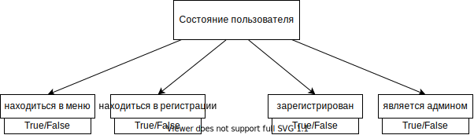

##Бизнес логика

##Реализация

Класс Person, будет описывать всех пользователей.
Чтобы бот определял как отвечать, у каждого пользователя будет
своё состояние.
За состояние отвечает множество полей boolean в классе Person

Это очень удобно потому что в будущем можно будет 
сколько угодно усложнять бота, расширяя состояние 
и добавляя новые поля

###База данных

Сначала буду хранить всех пользователей в массиве, потом подключу sqlLite,
и в массиве будут появлятся только те пользователи, которые
в это время переписываются с ботом, по истечению некоторого
времени без переписывания с ботом человек будет исчезать из 
этого массива, тк он уже есть в базе данных

Структура базы данных:

######Persons

| название      | тип           | описание     |
| ------------- | ------------- |------------- |
|VK_ID          | NUMBER        | id пользовате взятое из vk|
| PERSON_NAME         | VARCHAR(64)   |     имя которое пользователь указал при регистрации |
|EVENTS| VARCHAR(8000) |массив из id событий на которые зарегисрирован пользовотель |
|STATE|NUMBER|двоичное число показывающее состояние пользователя|

######Events

| название      | тип           | описание     |
| ------------- | ------------- |------------- |
|EVENT_ID          | NUMBER        | id события|
| EVENT_NAME         | VARCHAR(64)   |     название события |
|EVENT_DATE| DATE |дата когда будет событие |
|NUMBER_OF_PERSONS|NUMBER|количество учасников события|

###Потоки

вся программа сводиться к следующему: получить сообщение -> 
изменить состояния -> изменить базу данных -> ответить.\
и сделать это с каждым сообщением (если одновременно приходят
несколько сообщений то vk_api само выстроит их в очередь и они
будут будут обрабатываться один за другим)
поэтому будет достаточно одного потока, но я в main сделать 
возможность для многопоточности, на случай если нужно будет 
усложнить или оптимизировать бота 

    async def lspolling():
        Lslongpoll.listen()
    
    async def main():
    
        await asyncio.gather(
            lspolling()
            #тут может быть ещё функцции, 
            #они будут выполняться парралельно с lspolling()
        )
        
    asyncio.run(main())